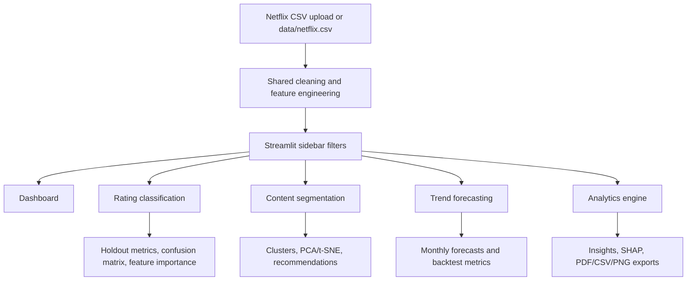

# Netflix Catalog Intelligence

A modular Streamlit application for Netflix catalog rating classification, content segmentation, catalog-add forecasting, automated EDA, recommendations, and report export. All charts and model outputs are computed from the CSV supplied by the user; the repository does not include sample or fabricated records.

## Features

- Upload a Netflix CSV in the sidebar or provide `data/netflix.csv`.
- Clean duplicates and normalize common Netflix column names; derive genre, country, director, cast, duration, release-decade, and catalog-add date features.
- Compare Logistic Regression, Random Forest, Decision Tree, and XGBoost rating classifiers with holdout accuracy, weighted precision/recall/F1, confusion matrices, and an optional Random Forest GridSearchCV.
- Run KMeans and Agglomerative clustering with elbow and silhouette diagnostics, PCA/t-SNE projections, cluster summaries, and nearest-neighbor recommendations.
- Forecast monthly catalog additions with Random Forest, ARIMA, and Prophet, evaluated using RMSE, MAE, and R². Forecast horizons are 12 and 24 months.
- Explore dataset summary, missingness, correlations, genre/country/rating distributions, catalog-add trends, fastest-growing genres, and narrative insights.
- Export a PDF report, zipped CSV tables, model metrics, forecast CSVs, fitted model, and Plotly PNG charts.
- Use global genre, rating, country, release-year, and content-type filters, plus a light/dark appearance control.

## Architecture



## Project structure

```text
.
├── app.py
├── data/                     # Place netflix.csv here, or upload it in the app
├── docs/
│   ├── demo_script.md
│   └── presentation_content.md
├── notebooks/                # Optional analysis notebooks
├── outputs/
│   ├── charts/
│   ├── models/
│   ├── reports/
│   └── screenshots/
├── scripts/
│   └── capture_screenshots.py
├── src/
│   ├── config.py
│   ├── task3_rating_classification.py
│   ├── task4_segmentation.py
│   ├── task5_forecasting.py
│   ├── task6_analytics_engine.py
│   └── utils.py
├── .streamlit/config.toml
├── requirements.txt
└── LICENSE
```

## Installation and launch

Python 3.10 or newer is recommended. From the project root on Windows:

```powershell
py -3.13 -m venv .venv
.\.venv\Scripts\Activate.ps1
python -m pip install --upgrade pip
pip install -r requirements.txt
streamlit run app.py
```

On macOS/Linux, replace the environment commands with:

```bash
python3 -m venv .venv
source .venv/bin/activate
python -m pip install --upgrade pip
pip install -r requirements.txt
streamlit run app.py
```

The app opens at `http://localhost:8501`. Upload the dataset in the sidebar, or place it at `data/netflix.csv` (`data/netflix_titles.csv` is also accepted). If there is exactly one CSV in the project root, it is auto-detected as well. The common Netflix titles columns are supported. Missing optional columns are created as unknown, but monthly forecasting needs actual `date_added` values spanning at least 30 calendar months. Without them, the app still shows annual release-year analysis and explains why monthly forecasts are unavailable.

For optional PNG export, install a compatible Chrome/Chromium binary for Kaleido if prompted:

```powershell
plotly_get_chrome
```

## Using the dashboard

1. Upload the Netflix CSV in the sidebar.
2. Select Dashboard, Rating classification, Content segmentation, Trend forecasting, or Analytics engine.
3. Apply sidebar filters; results are computed from the visible filtered records.
4. Run model actions on the relevant page. Training and clustering can take longer on large files.
5. Download the measured outputs or use the analytics export controls.

XGBoost, SHAP, statsmodels, and Prophet are declared in `requirements.txt`. Optional model failures are surfaced in the UI; they are not replaced with synthetic results. Classification and clustering use bounded, reproducible settings. The rating target is the dataset's `rating` field, which describes content ratings, not measured audience popularity or viewership.

## Screenshot generation

With the app running and a real CSV available, install the Playwright browser once and capture the dashboard states:

```powershell
playwright install chromium
python scripts/capture_screenshots.py --dataset data/netflix.csv
```

The script saves `dashboard_home.png`, `dataset_analysis.png`, `rating_prediction.png`, `clustering_results.png`, `forecasting_results.png`, `analytics_engine.png`, and `final_insights.png` in `outputs/screenshots/`. It runs the model actions for the corresponding pages, so a representative dataset with ratings, metadata, and catalog-add dates is needed. No screenshots are checked in because no dataset was present when this project was generated.

## Generate report and PowerPoint

After dependencies are installed and a Netflix CSV is available in the project root or `data/`, run:

```powershell
python scripts/generate_deliverables.py
```

This computes the EDA, rating-model holdout comparison, content segments, and catalog-add forecasts from the real dataset, then writes `Netflix_Project_Report.pdf` and `Netflix_Project_Presentation.pptx` to the project root. Plotly chart images used by the documents are also saved under `outputs/charts/`.

## Screenshots and results

Generated screenshots belong in `outputs/screenshots/`. Model scores, cluster assignments, and forecasts are dataset-dependent and are produced by the application after upload; no static metric values are claimed here. The dashboard provides CSV/PDF exports so evaluation results can be retained alongside the screenshots.

## GitHub setup

The local CSV and generated artifacts are excluded from Git by default. Review the dataset's license and privacy before sharing or committing it.

```bash
git init
git add .
git commit -m "Initial Commit"
git branch -M main
git remote add origin <repo_url>
git push -u origin main
```

## Limitations

- Dataset rating categories may be imbalanced; weighted scores are shown, and the confusion matrix makes class-level errors visible.
- Rating labels are treated as classification targets, not as success labels.
- Forecasts are extrapolations of observed catalog-add counts, not official Netflix plans.
- SHAP explanations are model-dependent and are only available for explainers supported by the selected fitted estimator.
- PNG export requires Kaleido's browser runtime; browser screenshots require Playwright Chromium and a running local app.